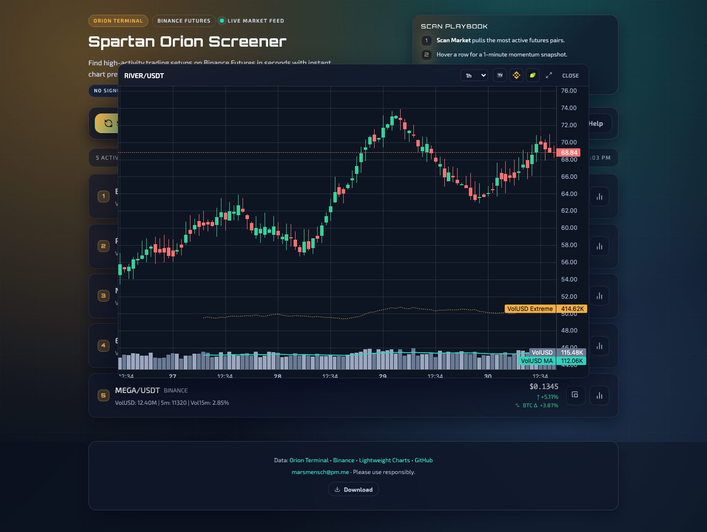

# Spartan Orion Screener

Single-file market scanner for Binance USDT-M futures. It pulls Orion Terminal setups, ranks the strongest candidates, shows instant chart previews, and shares compact social cards without any signup or API keys. GitHub Pages hosts the production demonstration build.

**[Launch App](https://mars-llm.github.io/orionterminal-spartan/)** · [Download HTML](https://raw.githubusercontent.com/mars-llm/orionterminal-spartan/main/index.html) · [GitHub](https://github.com/mars-llm/orionterminal-spartan)



## What You Get

- One-click scans with ranked `Top 1-3` candidates and metric tooltips
- Instant chart previews plus a larger modal with S/R overlays, MA, volume, funding, and open interest
- Built-in presets for majors, low caps, scalping, and the default mid-cap flow
- Settings for chart appearance, display behavior, and CORS/proxy management
- Social-card-only sharing for either the current top setups or the active filter state
- PWA install support and a downloadable `index.html` for local use

## Quick Start

1. Open the [live production demonstration build](https://mars-llm.github.io/orionterminal-spartan/) or download `index.html`.
2. Click **Scan Market**.
3. Hover a result row for the chart preview, or expand it for the full modal.
4. Use **Share Social Card** to create a visual share link.

If direct requests fail when opening `index.html` from `file://`, serve the folder locally and open it in the browser:

```bash
python3 -m http.server 8000
```

Install as an app from Chrome/Edge via the install icon, or from iOS Safari via **Share -> Add to Home Screen**.

## Sharing

- Sharing is social-card-only. Setup-link sharing is intentionally not part of the product anymore.
- If results exist, the card captures the top setups. If results are empty, it captures the active filter thresholds.
- Supported URLs are `?card=<payload>` and `?view=social-card&card=<payload>`.
- New links use compact `v2` payloads. Legacy `v1` payloads still decode.
- Cards expire after 3 days and expired cards are explicitly blocked.
- There is no backend storage; the full card payload lives in the URL.
- Social-card URLs are public by design, so never add private details to shared captions, filters, or derived metadata.

## Development

This is a single-file-first frontend app centered on `index.html`.

```bash
npm install
npm run sync:build-meta
npm test
```

Useful commands:

- `npm run test:e2e` runs the local Playwright suite.
- `npm run test:e2e:live` runs the live GitHub Pages gate.
- `npm run test:coverage` writes browser coverage summaries to `coverage/`.
- `npm run test:social-card` focuses on social-card regressions.

## Deployment Verification

- `npm run sync:build-meta` generates `build-meta.json`.
- The app exposes build metadata in the footer, on the root HTML element, and through `window.__ORION_BUILD_INFO__`.
- Runtime checks can verify `data-app-build`, `data-build-date`, `data-card-payload-version`, `data-service-worker-cache`, `data-runtime-channel`, and `data-build-source`.
- Public build metadata must stay release-safe: never expose local paths, usernames, tokens, or other private machine details.

## Data Sources

- [Orion Terminal](https://orionterminal.com) for screener data
- [Binance Futures](https://www.binance.com) for candles, funding, and open interest
- Binance Vision, Coinbase, and Kraken as chart fallbacks when needed
- Public CORS proxies when direct Orion access is blocked
- [Lightweight Charts](https://tradingview.github.io/lightweight-charts/) for chart rendering

MIT License
