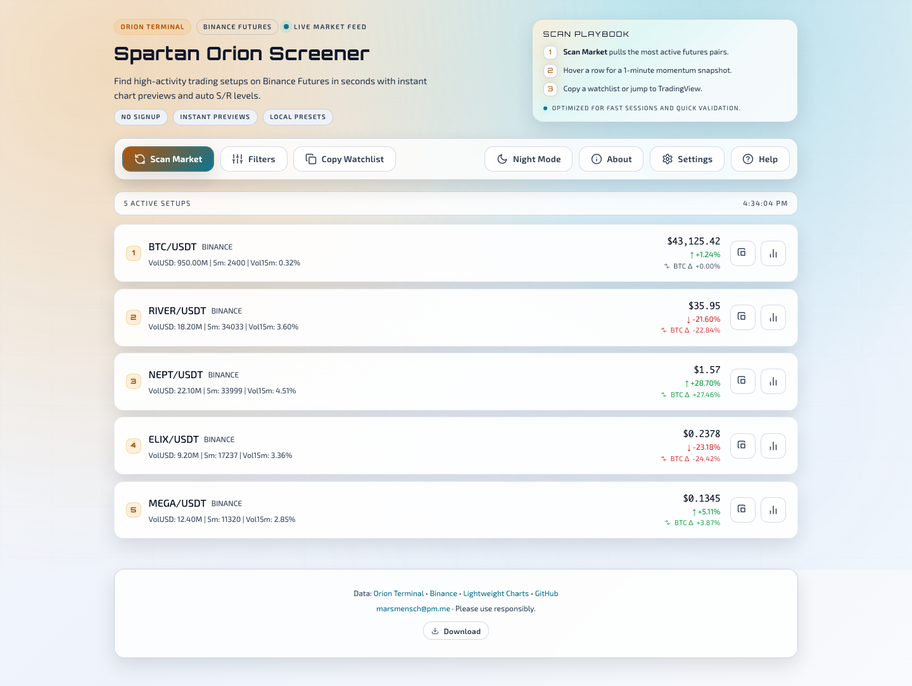

# Spartan Orion Screener

A single-file market scanner for Binance USDT‑M futures. Finds high-activity setups, highlights the best candidates, and shows instant chart previews with auto S/R levels.

**[Launch App](https://mars-llm.github.io/orionterminal-spartan/)** · [Download HTML](https://raw.githubusercontent.com/mars-llm/orionterminal-spartan/main/index.html)

**Socials:** [X (@marsmensch)](https://x.com/marsmensch) · [GitHub](https://github.com/mars-llm) · [Email](mailto:marsmensch@pm.me)

---

## UI Preview

<table>
  <tr>
    <td></td>
    <td></td>
  </tr>
</table>

## Features

- **One-click scan** — no signup, no API keys, no install
- **Top candidates** — pins **Top 1–3** with a score badge + metric breakdown (hover/tap)
- **Instant chart previews** — hover any row to see a 1m chart
- **Expanded chart view** — VolUSD histogram, MA, and S/R overlays
- **Futures extras** — funding rate + open interest in the chart header (prefetch for Top 1–3; on-hover for others)
- **BTC Δ signal** — asset 24h % minus BTC 24h %
- **Auto S/R levels** — 15m, 1h, 4h, and 1d candle high/low
- **Filter presets** — Default, High Volume Majors, Low Cap Gems, Scalping
- **Style controls** — customize chart colors and overlays
- **PWA support** — install as an app on desktop or mobile
- **Downloadable HTML** — run locally, with live data when connected

## Quick Start

1. Open the [live app](https://mars-llm.github.io/orionterminal-spartan/) or download `index.html`
2. Click **Scan Market**
3. Hover rows to preview charts (use **Expand** for the full modal)
4. Hover/tap the **Top** badge to see why it ranked

Live data needs an internet connection. If opening `index.html` directly causes scan requests to fail, serve it locally (for example: `python3 -m http.server`) and open `http://localhost:8000`.

## Filter Presets

| Preset | Focus |
|--------|-------|
| **Default** | Mid-cap alts with high activity |
| **High Volume Majors** | Large caps, lower volatility threshold |
| **Low Cap Gems** | Small caps under $10M volume |
| **Scalping** | High tick count for quick entries |

## Install as App

- **Chrome/Edge** — click the install icon in the address bar
- **iOS Safari** — Share → Add to Home Screen

## Data Sources

- [Orion Terminal](https://orionterminal.com) — screener data
- [Binance Futures](https://www.binance.com) — chart candles + futures extras (funding/open interest)
- Spot / fallback chart sources — Binance Vision, Coinbase, Kraken (when needed)
- Public CORS proxies — used when direct API access is blocked (for example `file://` or GitHub Pages)
- [Lightweight Charts](https://tradingview.github.io/lightweight-charts/) — charting library

## Development

- `npm install`
- `npm test` (Playwright)

---

MIT License
