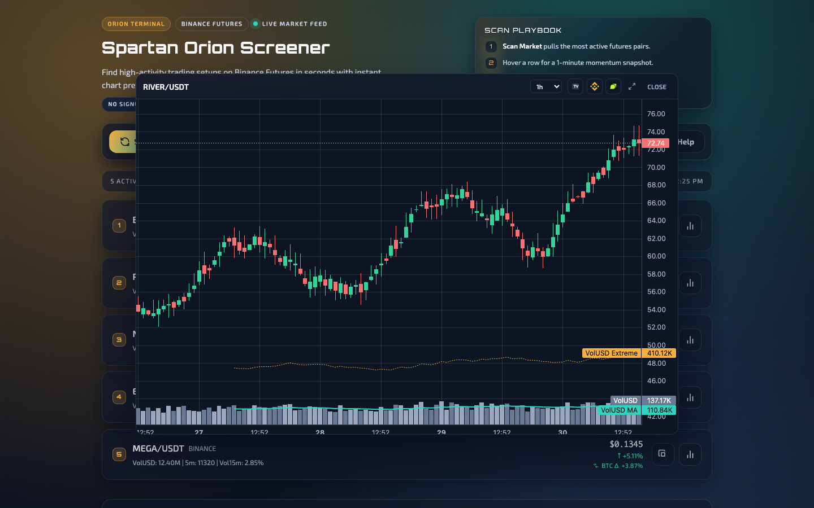
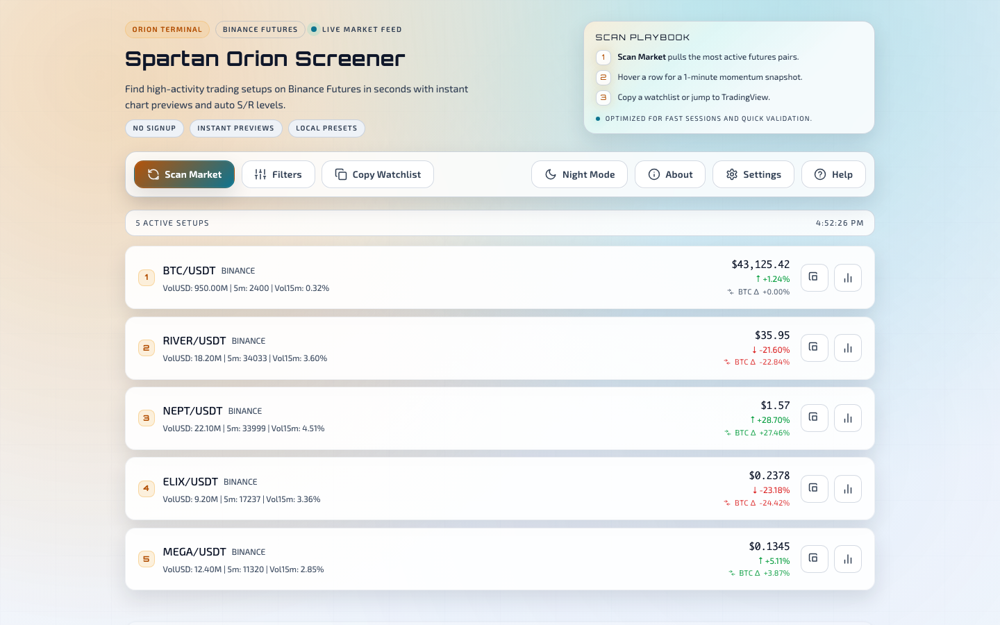

# Spartan Orion Screener

A single-file market scanner for Binance Futures. Finds high-activity setups and shows instant chart previews with S/R levels.

**[Launch App](https://mars-llm.github.io/orionterminal-spartan/)** · [Download HTML](https://raw.githubusercontent.com/mars-llm/orionterminal-spartan/main/docs/index.html)

---

## UI Preview

<table>
  <tr>
    <td></td>
    <td></td>
  </tr>
</table>

## Features

- **One-click scan** — no signup, no API keys, no install
- **Instant chart previews** — hover any row to see a 1m chart
- **Expanded chart view** — VolUSD histogram, MA, and S/R overlays
- **BTC Δ signal** — asset 24h % minus BTC 24h %
- **Auto S/R levels** — 15m, 1h, 4h, and 1d candle high/low
- **Filter presets** — Default, High Volume Majors, Low Cap Gems, Scalping
- **PWA support** — install as an app on desktop or mobile
- **Downloadable HTML** — run locally, with live data when connected

## Quick Start

1. Open the [live app](https://mars-llm.github.io/orionterminal-spartan/) or download `index.html`
2. Click **Scan Market**
3. Hover results to preview charts

No server required. Live data still needs an internet connection.

## Filter Presets

| Preset | Focus |
|--------|-------|
| **Default** | Mid-cap alts with high activity |
| **High Volume Majors** | Large caps, lower volatility threshold |
| **Low Cap Gems** | Small caps under $10M volume |
| **Scalping** | High tick count for quick entries |

## Install as App

- **Chrome/Edge** — click the install icon in the address bar
- **iOS Safari** — Share → Add to Home Screen

## Data Sources

- [Orion Terminal](https://orionterminal.com) — screener data
- [Binance Futures](https://www.binance.com) — chart candles
- [Lightweight Charts](https://tradingview.github.io/lightweight-charts/) — charting library

---

MIT License
